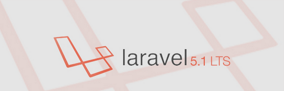

# career-tag

#### Developed using

### Installation guidelines

 - To clone repository use **git clone git@github.com:woxiprogrammers/career-tag.git**
 - There are two main branches
 ```
    * master

    * develop
  ```
 - always pull code from develop for local development.
 - create .env file in root directory and copy all content from .env.example to .env file and
   make changes according to requirement like database and other required passwords according
   to your local environment.
